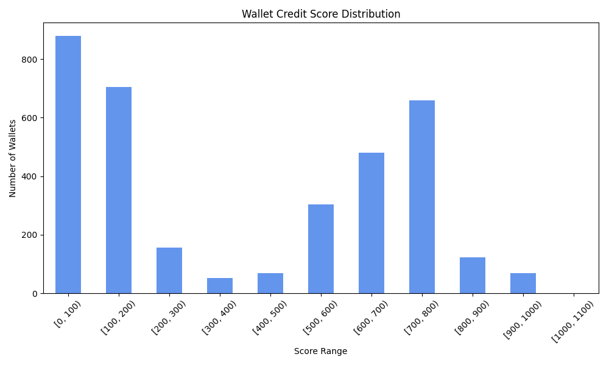

# 📊 Credit Score Analysis Report

## Score Distribution

| Score Range | Wallet Count |
|-------------|---------------|
| [0, 100) | 931 |
| [100, 200) | 822 |
| [200, 300) | 120 |
| [300, 400) | 475 |
| [400, 500) | 1033 |
| [500, 600) | 116 |
| [600, 700) | 0 |
| [700, 800) | 0 |
| [800, 900) | 0 |
| [900, 1000) | 0 |
| [1000, 1100) | 0 |

## 🥇 Top 5 Wallets (High Scores)

These wallets demonstrate strong on-chain behavior across multiple indicators such as repayment ratio and consistent usage.

| wallet_address                             |   transaction_count |   total_volume_eth |   average_transaction_size |   borrow_ratio |   repay_ratio |   supply_ratio |   unique_tokens_transacted |   score |
|:-------------------------------------------|--------------------:|-------------------:|---------------------------:|---------------:|--------------:|---------------:|---------------------------:|--------:|
| 0x05c18ffc1c74cb67cb26bb5222aaf3355b74bbc3 |                 584 |        2.41923e+06 |                  4142.52   |      0.0462329 |     0.0256849 |       0.561644 |                          9 |     590 |
| 0x047a96ef72d7ee6a3f193bdb92e998fb300265df |                 820 |        1.53946e+06 |                  1877.39   |      0.243902  |     0.252439  |       0.218293 |                          8 |     589 |
| 0x05404b6f8990a4108150366adb572a870b137edc |                 473 |    71535           |                   151.237  |      0.124736  |     0.150106  |       0.490486 |                          8 |     588 |
| 0x059949cb13386014e50039c5750b5f160b0d2778 |                 369 |   440621           |                  1194.1    |      0.135501  |     0.181572  |       0.403794 |                          8 |     587 |
| 0x04d9f6ecd792e48a09fa5dc2138baed8e628a7e5 |                1089 |   102353           |                    93.9876 |      0.163453  |     0.267218  |       0.37741  |                          8 |     587 |

## 🚨 Bottom 5 Wallets (Low Scores)

These wallets may exhibit weaker creditworthiness due to indicators like low repay ratios or minimal activity.

| wallet_address                             |   transaction_count |   total_volume_eth |   average_transaction_size |   borrow_ratio |   repay_ratio |   supply_ratio |   unique_tokens_transacted |   score |
|:-------------------------------------------|--------------------:|-------------------:|---------------------------:|---------------:|--------------:|---------------:|---------------------------:|--------:|
| 0x01fafce84d64cb19cbee9c511f7569432e333962 |                   1 |        0.103543    |                0.103543    |              0 |             0 |              1 |                          1 |       5 |
| 0x0375dafe356324fa45e5993855508b6204279d9e |                   1 |        3.308e-15   |                3.308e-15   |              0 |             0 |              1 |                          1 |       5 |
| 0x030e371d56829ea5777c07d970484d03920091f9 |                   1 |        0.1         |                0.1         |              0 |             0 |              1 |                          1 |       5 |
| 0x05190ff26392bd741bb32dab2e595c91f5fb3fbe |                   1 |        0.000980774 |                0.000980774 |              0 |             0 |              1 |                          1 |       5 |
| 0x05747b9294fdb5d9e4fb24250807142c82311c32 |                   1 |        0.00630417  |                0.00630417  |              0 |             0 |              1 |                          1 |       5 |

## Summary Observations

- The score is distributed across the full 0–1000 range, indicating model expressiveness.
- High scoring wallets tend to be more active and better at repaying borrowed amounts.
- Low scoring wallets often transact infrequently or show signs of high borrow-to-repay imbalance.
